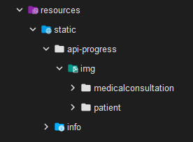

# 🦷 Gestión de Consulta Médica Odontológica (Backend)

Este proyecto es un sistema backend para gestionar consultas médicas odontológicas, permitiendo el registro y
seguimiento de pacientes, evaluaciones previas y consultas médicas con especialistas.

## 🏥 **Narrativa del sistema**

Un paciente acude a un centro especialista de odontologia para solicitar una consulta.
Si el paciente no esta registrado, se procede a solicitar sus datos personales y crear una ficha medica.
Si el paciente esta registrado, una enfermera encargada procede a hace una pequena toma de signos vitales actualizando
la ficha medica del paciente donde se especifica el caso para determinar que especialista lo atendera en la consulta.
Posteriormente se realiza la consulta medica con el especialista asignado, donde el medico genera un diagnostico que se
agrega la consulta medica actual y se guarda la consulta medica actual en la ficha medica del paciente.

### 🔍 **Casos y Especialistas Asignados**

- **Caries** → 🦷 Odontólogo General
- **Brackets** → 🏗️ Ortodoncista
- **Encías** → 🌿 Periodoncista
- **Otro** → 🦷 Odontólogo General

---

# 🗂️ **Entidades del Sistema**

## 🏨 **Consulta Médica**

### `ConsultaMedica`
| **Campo**               | **Descripción**        |
|-------------------------|------------------------|
| `id`                    | Identificador único    |
| `EvaluacionPrevia evlp` | Evaluación previa      |
| `MedicoEspecialista mdep`| Médico especialista    |
| `diagnostico`           | Diagnóstico de la consulta |

---

## 👤 **Paciente**

### `Paciente` (INPUT)
| **Campo**     | **Descripción**              |
|---------------|------------------------------|
| `id`          | Identificador único          |
| `nombre`      | Nombre del paciente          |
| `apellido`    | Apellido del paciente        |
| `edad`        | Edad del paciente            |
| `genero`      | Género del paciente          |
| `cedula`      | Número de cédula del paciente |
| `...otros datos personales` | Otros detalles del paciente |

---

## ⚕️ **Síntoma**

### `Sintoma`
| **Campo**     | **Descripción**        |
|---------------|------------------------|
| `id`          | Identificador único    |
| `nombre`      | Nombre del síntoma     |

---

## 👨‍⚕️ **Médico Especialista**

### `MedicoEspecialista`
| **Campo**      | **Descripción**         |
|----------------|-------------------------|
| `id`           | Identificador único     |
| `nombre`       | Nombre del médico       |
| `especialidad` | Especialidad médica     |

---

## 👩‍⚕️ **Enfermera**

### `Enfermera`
| **Campo**     | **Descripción**        |
|---------------|------------------------|
| `id`          | Identificador único    |
| `nombre`      | Nombre de la enfermera |

##  🧾**Avances - API**

